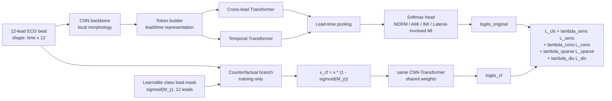
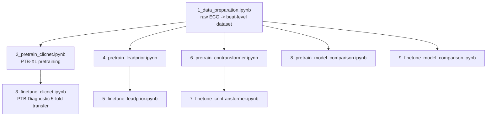

# CLIC-Net: Counterfactual Lead-Intervention Consistency Network

CLIC-Net is a 12-lead ECG myocardial infarction (MI) localization framework for four-class softmax classification:

1. `NORM`
2. `AMI`
3. `IMI`
4. `Lateral-involved MI`

The main model is a **CNN-Transformer-based classifier** with an adaptive counterfactual lead-intervention objective. Instead of using fixed anatomical lead priors, CLIC-Net learns class-specific lead masks from data and uses counterfactual masking during training to test whether the target-class logit is sensitive to the learned lead intervention.

> This repository contains code and notebooks only. ECG datasets, experiment outputs, manuscript files, and generated paper figures are intentionally excluded from the public repository.

---

## Highlights

- Beat-level 12-lead ECG preprocessing from PTB-XL and PTB Diagnostic.
- Four-class MI localization with a clinically motivated `Lateral-involved MI` class.
- CLIC-Net training with:
  - standard cross-entropy classification loss,
  - counterfactual sensitivity loss,
  - non-target consistency loss,
  - mask sparsity loss,
  - mask diversity loss.
- Transfer learning workflow from PTB-XL to PTB Diagnostic.
- Baseline comparisons:
  - CLIC-Net,
  - fixed lead-prior model,
  - CNN-Transformer model,
  - classical deep learning comparisons such as CNN1D, LSTM, GRU, CNN-LSTM,
  - optional external ECG representation baselines.

---

## Architecture



### Counterfactual Learning Intuition

For each sample with class label `y`, CLIC-Net learns a class-specific lead mask `M_y`.
The original input and counterfactual input are:

```text
x_original -> model -> logits_original
x_cf = x_original * (1 - sigmoid(M_y))
x_cf       -> model -> logits_cf
```

The model is trained so that:

- the target-class logit should decrease after applying the learned target-class mask,
- non-target logits should remain reasonably stable,
- masks should not select all leads,
- masks for different classes should not collapse into identical patterns.

This makes the learned mask a training-time intervention mechanism, not only a visualization.

---

## Why `Lateral-involved MI`?

Strict lateral-only MI is very sparse in PTB Diagnostic. In the current processed data, the strict lateral-only evidence is concentrated in one patient, and the raw diagnostic labels contain three lateral-only records for that patient.

Using strict lateral-only as an independent class would make the target-domain evaluation unstable. Therefore, this project uses a broader but explicit class:

```text
Lateral-involved MI
```

This class includes ECG records with lateral-wall involvement, including overlap patterns such as:

- lateral,
- antero-lateral,
- infero-lateral,
- postero-lateral,
- infero-postero-lateral.

This label design preserves the clinical concept of lateral-wall involvement while making the class less sparse. It also motivates CLIC-Net: overlap-territory MI can be heterogeneous, so a rigid fixed lead prior may not match every lateral-involved pattern.

---

## Repository Layout

```text
.
├── notebook/
│   ├── 1_data_preparation.ipynb
│   ├── 2_pretrain_clicnet.ipynb
│   ├── 3_finetune_clicnet.ipynb
│   ├── 4_pretrain_leadprior.ipynb
│   ├── 5_finetune_leadprior.ipynb
│   ├── 6_pretrain_cnntransformer.ipynb
│   ├── 7_finetune_cnntransformer.ipynb
│   ├── 8_pretrain_model_comparison.ipynb
│   └── 9_finetune_model_comparison.ipynb
├── dataset/                  # generated locally, ignored by git
├── outputs/                  # generated locally, ignored by git
├── run_clicnet_pipeline.sh
├── pyproject.toml
├── uv.lock
└── README.md
```

Public GitHub intentionally excludes:

- raw ECG data,
- processed beat arrays,
- training outputs,
- checkpoints,
- paper/manuscript artifacts,
- generated figures for LaTeX.

---

## Notebook Flow



### Main Notebooks

| Notebook | Purpose |
|---|---|
| `1_data_preparation.ipynb` | Builds beat-level 100 Hz 12-lead ECG datasets from raw PTB-XL and PTB Diagnostic inputs. |
| `2_pretrain_clicnet.ipynb` | Pretrains CLIC-Net on PTB-XL. |
| `3_finetune_clicnet.ipynb` | Fine-tunes CLIC-Net on PTB Diagnostic using 5-fold transfer learning. |
| `4_pretrain_leadprior.ipynb` | Pretrains the fixed lead-prior comparison model. |
| `5_finetune_leadprior.ipynb` | Fine-tunes the fixed lead-prior comparison model. |
| `6_pretrain_cnntransformer.ipynb` | Pretrains the CNN-Transformer baseline. |
| `7_finetune_cnntransformer.ipynb` | Fine-tunes the CNN-Transformer baseline. |
| `8_pretrain_model_comparison.ipynb` | Runs additional pretraining model comparisons. |
| `9_finetune_model_comparison.ipynb` | Runs additional fine-tuning model comparisons. |

---

## Results Snapshot

The following values come from the latest local experiment artifacts before repository cleanup. Re-run the notebooks to reproduce or update them.

| Model | Setting | Test macro-F1 | Weighted-F1 | Balanced accuracy | Macro-AUC |
|---|---:|---:|---:|---:|---:|
| CLIC-Net | full fine-tune | `0.9016 ± 0.0103` | `0.9103 ± 0.0091` | `0.9030` | `0.9697` |
| CNN-Transformer | full fine-tune | `0.8882 ± 0.0114` | `0.8921 ± 0.0131` | `0.8885` | `0.9686` |
| Fixed lead-prior model | full fine-tune | `0.8683 ± 0.0169` | `0.8701 ± 0.0156` | `0.8664` | `0.9715` |
| LSTM | single fine-tune | `0.8443` | `0.8577` | `0.8597` | `0.9572` |
| HuBERT-ECG | single fine-tune | `0.6581` | `0.7043` | `0.6533` | `0.8591` |
| ECG-FM | single fine-tune | `0.1331` | `0.1933` | `0.2500` | `0.5031` |

Best observed CLIC-Net fold:

| Strategy | Fold | Accuracy | Macro-F1 | Weighted-F1 |
|---|---:|---:|---:|---:|
| full fine-tune | 5 | `0.9250` | `0.9150` | `0.9232` |

---

## Installation

### 1. Clone the repository

```bash
git clone <your-new-repository-url>
cd myocardial-infarction-localization
```

### 2. Install `uv`

If `uv` is not installed:

```bash
curl -LsSf https://astral.sh/uv/install.sh | sh
```

Restart the shell if needed, then verify:

```bash
uv --version
```

### 3. Create the environment

```bash
uv sync
```

This installs the dependencies declared in `pyproject.toml`, including PyTorch, Jupyter, scientific Python packages, WFDB, and optional ECG representation dependencies.

### 4. Register the Jupyter kernel

```bash
uv run python -m ipykernel install --user --name clicnet-mi-localization --display-name "CLIC-Net MI Localization"
```

---

## Data Setup

The repository does not include raw or processed ECG data.

### PTB-XL

Download PTB-XL from PhysioNet:

- Dataset page: `https://physionet.org/content/ptb-xl/`

After extraction, the PTB-XL raw root should contain files/folders similar to:

```text
ptb-xl-a-large-publicly-available-electrocardiography-dataset-*/
├── ptbxl_database.csv
├── scp_statements.csv
├── records100/
└── records500/
```

The data-preparation notebook needs the folder that directly contains `ptbxl_database.csv`.

### PTB Diagnostic

The current data-preparation notebook expects a PTB Diagnostic raw folder containing:

```text
ptb_diagnostic_raw/
├── data_raw.npz
└── meta.csv
```

If you use a different PTB Diagnostic format, adapt the loader in `notebook/1_data_preparation.ipynb` or convert the raw records into the expected `data_raw.npz` and `meta.csv` format.

### Recommended local data layout

You may keep raw data outside the Git repository:

```text
/path/to/ecg_data/
├── ptb-xl/
│   ├── ptbxl_database.csv
│   ├── scp_statements.csv
│   └── records100/
└── ptb-diagnostic/
    ├── data_raw.npz
    └── meta.csv
```

Then point the pipeline to those folders using environment variables:

```bash
export CLICNET_PTB_XL_RAW_ROOT="/path/to/ecg_data/ptb-xl"
export CLICNET_PTB_DIAGNOSTIC_RAW_ROOT="/path/to/ecg_data/ptb-diagnostic"
```

The processed outputs will be generated inside:

```text
dataset/ptb_xl/
dataset/ptb_diagnostic/
dataset/combined_split_summary.csv
```

These processed dataset folders are ignored by Git.

---

## Running the Pipeline

### Option A: Run all notebooks sequentially

Edit `run_clicnet_pipeline.sh` if you want fixed defaults, or pass environment variables from the shell.

```bash
SEED=42 \
EPOCHS=50 \
PTB_XL_RAW_ROOT="/path/to/ecg_data/ptb-xl" \
PTB_DIAGNOSTIC_RAW_ROOT="/path/to/ecg_data/ptb-diagnostic" \
bash run_clicnet_pipeline.sh
```

Run in the background:

```bash
nohup bash run_clicnet_pipeline.sh > output.log 2>&1 &
echo $! > clicnet_pipeline.pid
```

Check progress:

```bash
tail -f output.log
```

If `SEED` or `EPOCHS` is empty or set to `0`, the notebooks fall back to their internal defaults:

```text
seed   = 42
epochs = 50
```

### Option B: Run notebooks manually

Start Jupyter:

```bash
uv run jupyter lab
```

Then run the notebooks in order:

```text
1_data_preparation.ipynb
2_pretrain_clicnet.ipynb
3_finetune_clicnet.ipynb
4_pretrain_leadprior.ipynb
5_finetune_leadprior.ipynb
6_pretrain_cnntransformer.ipynb
7_finetune_cnntransformer.ipynb
8_pretrain_model_comparison.ipynb
9_finetune_model_comparison.ipynb
```

---

## Outputs

After running the notebooks, results are saved under `outputs/`.

Typical CLIC-Net output structure:

```text
outputs/
├── 2_pretrain_clicnet/
│   └── YYYYMMDD_HHMMSS/
│       ├── configs/
│       ├── logs/
│       ├── metrics/
│       ├── plots/
│       ├── predictions/
│       ├── checkpoints/
│       └── transfer_ready/
└── 3_finetune_clicnet/
    └── YYYYMMDD_HHMMSS/
        ├── configs/
        ├── logs/
        ├── metrics/
        ├── aggregate_results/
        ├── plots/
        └── transfer_strategies/
            ├── no_pretrain/
            ├── frozen_backbone/
            ├── partial_finetune/
            └── full_finetune/
```

Important generated artifacts:

| Artifact | Meaning |
|---|---|
| `metrics/final_metrics.csv` | Final split metrics. |
| `metrics/classification_report.csv` | Per-class precision, recall, F1, sensitivity, specificity. |
| `metrics/test_confusion_matrix.csv/png` | Held-out test confusion matrix. |
| `metrics/test_roc_curve.csv/png` | Test ROC curve data and figure. |
| `metrics/test_pr_curve.csv/png` | Test precision-recall curve data and figure. |
| `metrics/learned_class_lead_mask.csv/png` | CLIC-Net learned class-specific lead mask. |
| `transfer_ready/` | Pretrained artifacts for downstream fine-tuning. |

---

## Reproducibility Notes

- Default seed: `42`
- Default epochs: `50`
- Classification head: four-class softmax
- Loss function: cross-entropy plus CLIC-Net counterfactual regularizers
- Main evaluation: PTB Diagnostic fine-tuning / transfer learning
- Main selection metric: macro-F1

The exact metrics may differ across hardware, PyTorch/CUDA versions, and data conversion choices.

---

## Public Repository Notes

The `.gitignore` excludes:

- `dataset/`
- `outputs/`
- checkpoints and NumPy arrays
- manuscript folders `file-tex/` and `fig-tex/`
- `notebook/final_summary_figures_for_tex.ipynb`
- local logs and PID files

This keeps the public repository focused on reproducible code and notebooks.

---

## Citation

If you use this repository, please cite the associated paper or thesis manuscript when it becomes available.

```bibtex
@misc{clicnet_mi_localization,
  title  = {CLIC-Net: Counterfactual Lead-Intervention Consistency Network for Myocardial Infarction Localization},
  author = {Rahmanto, Nugroho and collaborators},
  year   = {2026},
  note   = {Code repository}
}
```

---

## License

Add a license before publishing the repository. If unsure, consider `MIT` for code or a more restrictive license if the project is tied to unpublished academic work.
